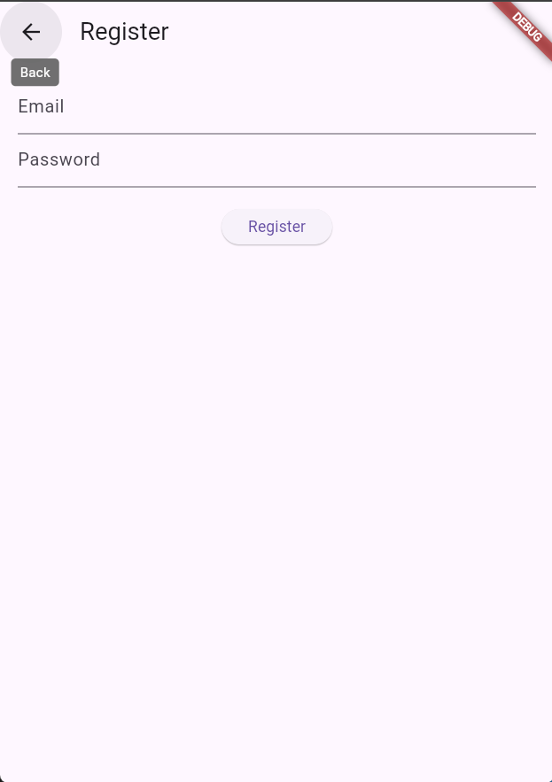
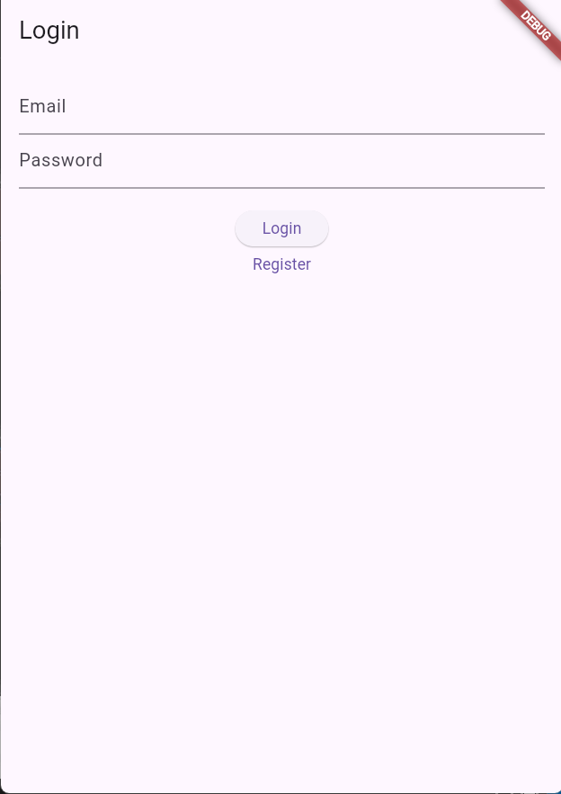
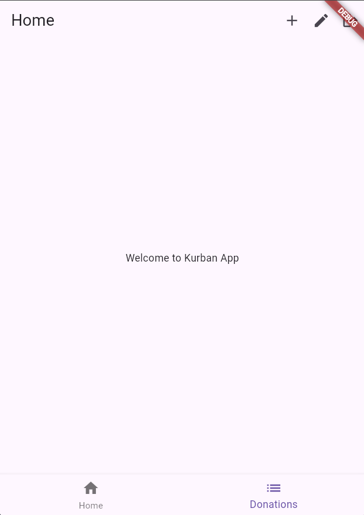
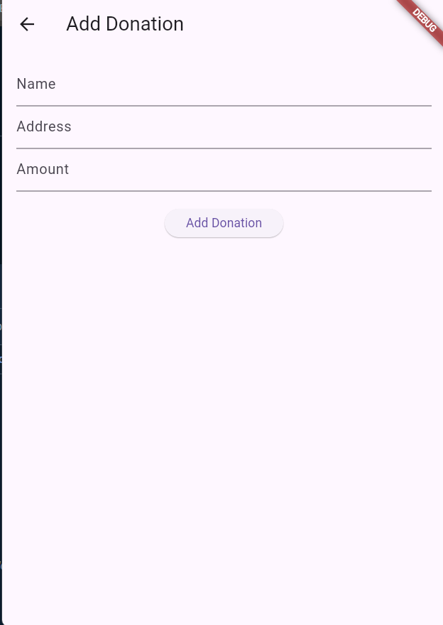
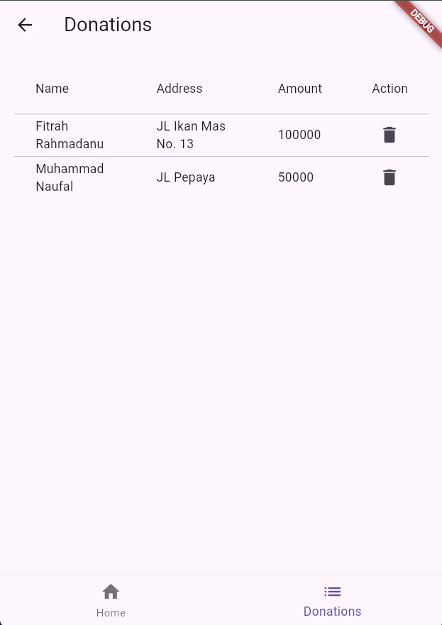

# kurban_app
Proyek ini adalah sebuah aplikasi Flutter yang bertujuan untuk mengelola donasi untuk Kurban. Aplikasi ini memungkinkan pengguna untuk menambahkan, menghapus, dan melihat daftar donasi yang telah dilakukan.

## Fitur Utama
Autentikasi Pengguna: Pengguna dapat melakukan login dan registrasi menggunakan email dan password.
Tambah Donasi: Pengguna dapat menambahkan detail donasi seperti nama, alamat, dan jumlah donasi.
Hapus Donasi: Pengguna dapat menghapus donasi yang sudah ada.
Tampilan Donasi: Menampilkan daftar donasi dalam bentuk tabel dengan detail nama, alamat, dan jumlah donasi.
Navigasi: Menggunakan BottomNavigationBar untuk navigasi antara layar Home dan layar Donasi.
Dialog: Menggunakan AlertDialog untuk menambahkan donasi baru.

## Screenshot

)

)

)

)

)

## Libraries
- Proyek ini menggunakan beberapa library dan framework:
- Flutter: Framework UI untuk pengembangan aplikasi mobile dengan bahasa Dart.
- Firebase: Platform backend yang digunakan untuk autentikasi pengguna dan menyimpan data donasi.
- Provider: State management untuk mengelola keadaan aplikasi dan berbagi data antara widget.
- Firebase Authentication: Untuk mengelola autentikasi pengguna dengan email dan password.
- Firebase Firestore: Database NoSQL untuk menyimpan data donasi.
- Material Design: Desain visual yang digunakan dalam komponen UI Flutter seperti AppBar, AlertDialog, dan BottomNavigationBar.

  `cupertino_icons: ^1.0.6`
  `firebase_core: ^3.1.0`
  `cloud_firestore: ^5.0.1`
  `firebase_auth: ^5.1.0`
  `provider: ^6.1.2`

## Penggunaan
Untuk menjalankan proyek ini, pastikan telah mengatur konfigurasi Firebase dengan Firebase Console dan mengganti file firebase_options.dart dengan opsi Firebase yang sesuai untuk platform yang Anda gunakan.

## Instalasi
Clone repositori ini ke dalam direktori lokal Anda.
Buka proyek menggunakan editor seperti Visual Studio Code atau Android Studio.
Pastikan telah menginstal Flutter dan mengatur path Flutter pada environment Anda.
Jalankan flutter pub get untuk menginstal semua dependensi yang diperlukan.
Hubungkan perangkat fisik atau emulator untuk menjalankan aplikasi dengan perintah flutter run.

## Kontribusi
Anda dapat berkontribusi pada proyek ini dengan mengirimkan pull request dan melaporkan issue di repositori GitHub ini.
Dengan menyusun README.md seperti di atas, pengguna atau pengembang baru dapat dengan mudah memahami struktur, fitur, dan teknologi yang digunakan dalam proyek aplikasi Flutter Kurban App Anda.
